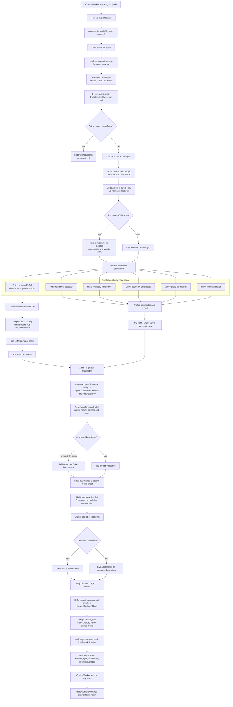

# Custom Segmentation Pipeline Flowchart

This flowchart shows the deterministic custom segmentation path used by
`workers/segmenters/segmentation_service.py`.

```mermaid
flowchart TD
    A["CustomWorker.process_task(task)"] --> B["Resolve audio file path"]
    B --> C["process_file_path(file_path, params)"]
    C --> D["Read audio file bytes"]
    D --> E["_analyze_content(content, filename, params)"]

    E --> F["Load audio from bytes<br/>librosa, 22050 Hz mono"]
    F --> G["Detect active region<br/>RMS threshold over full track"]
    G --> H{"Active music region found?"}

    H -- "No" --> Z["Return empty result<br/>segments = []"]

    H -- "Yes" --> I["Crop to active audio region"]
    I --> J["Extract shared feature grid<br/>Chroma-CENS and MFCC"]
    J --> K["Median-pool to target FPS<br/>L2 normalize features"]
    K --> L{"Too many SSM frames?"}
    L -- "Yes" --> M["Further median-pool features<br/>renormalize and update FPS"]
    L -- "No" --> N["Use extracted feature grid"]
    M --> O["Parallel candidate generation"]
    N --> O

    subgraph P["Parallel candidate generation"]
        P1["Tempo and beat detection"]
        P2["RMS boundary candidates"]
        P3["Onset boundary candidates"]
        P4["Chord-proxy candidates"]
        P5["Timed lyric candidates"]
        P6["Build combined SSM<br/>chroma plus optional MFCC"]
    end

    O --> P1
    O --> P2
    O --> P3
    O --> P4
    O --> P5
    O --> P6

    P1 --> Q["Collect candidates and curves"]
    P2 --> Q
    P3 --> Q
    P4 --> Q
    P5 --> Q
    P6 --> R["Smooth and threshold SSM"]

    R --> S["Compute SSM novelty<br/>checkerboard plus structure novelty"]
    S --> T["Find SSM boundary peaks"]
    T --> U["Add SSM candidates"]
    Q --> V["Add RMS, onset, chord, lyric candidates"]
    U --> W["Add beat-phrase candidates"]
    V --> W

    W --> X["Compute dynamic source weights<br/>signal quality from novelty and beat regularity"]
    X --> Y["Fuse boundary candidates<br/>merge nearby sources and score"]
    Y --> AA{"Any fused boundaries?"}
    AA -- "No, but SSM exists" --> AB["Fallback to top SSM boundaries"]
    AA -- "Yes" --> AC["Use fused boundaries"]
    AB --> AD["Snap boundaries to beat or strong onset"]
    AC --> AD

    AD --> AE["Build boundary time list<br/>0, snapped boundaries, total duration"]
    AE --> AF["Cluster and label segments"]
    AF --> AG{"SSM labels available?"}
    AG -- "Yes" --> AH["Use SSM repetition labels"]
    AG -- "No" --> AI["KMeans fallback on segment descriptors"]
    AH --> AJ["Map clusters to A, B, C labels"]
    AI --> AJ
    AJ --> AK["Enforce minimum segment duration<br/>merge short neighbors"]
    AK --> AL["Assign section_type<br/>Intro, Chorus, Verse, Bridge, Outro"]
    AL --> AM["Shift segment times back to full-track timeline"]
    AM --> AN["Build result JSON<br/>duration, bpm, candidates, segments, status"]
    AN --> AO["CustomWorker returns segments"]
    AO --> AP["BaseWorker publishes segmentation.result"]
```
