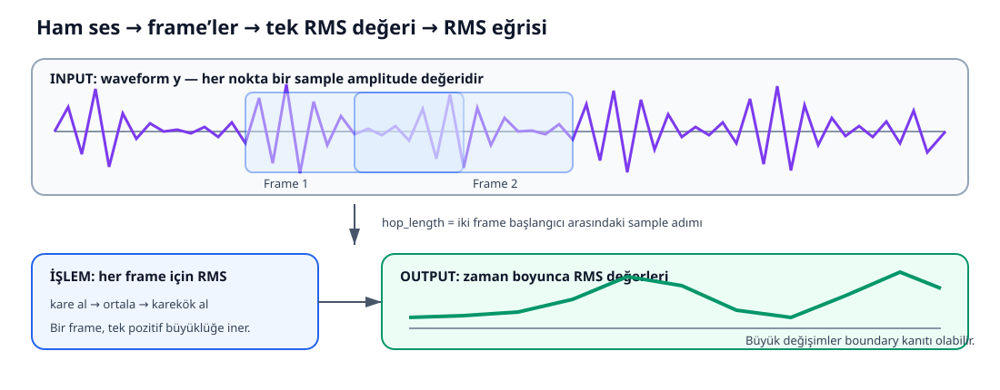

# Müzik Segmentasyonu Eğitim Kitabı

> Bu kitapta diyagramları soldan sağa takip et: **input → işlem → output**.

## Büyük resim

~~~mermaid
flowchart LR
    A[INPUT<br/>Audio dosyası] --> B[Decode + mono<br/>22.050 Hz waveform]
    B --> C[Feature extraction<br/>RMS, Chroma, MFCC, Onset, Beat]
    C --> D[Feature-level fusion<br/>custom_librosa boundary'leri]
    A --> E[MSAF<br/>Foote, CNMF, SCluster]
    D --> F[Algorithm-level fusion]
    E --> F
    F --> G[OUTPUT<br/>Boundary + Segment + Label + Diagnostics]
~~~



Görselin okunuşu:

1. **Input:** Mor çizgi ham waveform'dur; her nokta bir sample amplitude değeridir.
2. **İşlem:** Örtüşebilen frame pencereleri içinde RMS hesaplanır.
3. **Output:** Her frame tek RMS değerine dönüşür; zaman boyunca RMS eğrisi oluşur.

Bu eğitim seti aşağıdaki dört dosyayı okuyup savunabilecek düzeyde öğrenmek içindir:

- [Custom pipeline](segmentation-service.md): `segmentation_service.py`
- [Feature fusion](multi-feature-fusion.md): `multi_feature_fusion.py`
- [MSAF adapter](msaf-worker.md): `msaf_worker.py`
- [Algorithm fusion](algorithm-fusion.md): `fusion_service.py`

`PRESENTATION_GUIDE.md` sunum hikâyesidir. Buradaki belgeler ise terimleri sıfırdan öğretir, formülleri sayısal örneklerle açar ve her metodun neden var olduğunu anlatır.

## 1. Problem: boundary, segment ve label

```text
0:00          0:18             0:46             1:15
| Intro       | Verse          | Chorus         | Verse ...
```

`0:18`, `0:46`, `1:15` birer **boundary**'dir: bir bölümün bitip diğerinin başladığı zaman noktası. İki boundary arasındaki aralık **segment**'tir.

Sistem üç ayrı karar verir:

1. **Boundary detection:** Değişim hangi saniyede oldu?
2. **Structural labeling:** Hangi segmentler birbirine benziyor? Örnek: `A, B, A, C`.
3. **Semantic labeling:** Segment Intro, Verse veya Chorus gibi hangi role benziyor?

Structural `A`, doğrudan Verse değildir; aynı yapısal kümeye giren segmentlerin ortak adıdır.

## 2. Dijital sesin temelleri

### Sample, sample rate, amplitude

Sürekli ses dalgasından alınan her sayısal ölçüme **sample** denir. Kod sesi `y` adlı NumPy dizisinde tutar:

```python
y = [0.00, 0.12, -0.08, 0.25, ...]
```

Pozitif/negatif işaret “ses var/yok” değil, dalganın denge noktasının hangi tarafında olduğunu gösterir. **Amplitude (genlik)** bu noktadan uzaklıktır.

**Sample rate (`sr`)**, saniyedeki sample sayısıdır. `_SR = 22050` ise bir saniye 22.050 sayıdır:

```text
sample zamanı = sample_indeksi / sr
11025 / 22050 = 0.5 saniye
```

### Frame, hop length, FPS

Tek sample müzik yapısını anlatmak için küçüktür. Yan yana sample'lardan oluşan kısa analiz bloğuna **frame** denir. **Hop length**, sonraki frame için kaç sample ilerlediğimizdir.

```text
sr / hop_length = 22050 / 512 ≈ 43.07 frame/saniye
```

Yaklaşık her 23,2 ms'de feature ölçülür; sonra yaklaşık 10 FPS'e median-pool edilir.

### Feature

Ham sample'lardan çıkarılan belirli bir niteliğin sayısal özetidir:

- RMS: genlik/enerji büyüklüğü
- Chroma: 12 nota sınıfının etkinliği
- MFCC: tınının sıkıştırılmış özeti
- Onset strength: yeni ses olaylarının başlama gücü
- Beat times: ritmik vuruş zamanları

Feature gerçekliğin tamamı değil, belirli bir soruya bakan ölçüm merceğidir.

## 3. RMS'i sıfırdan anlamak

RMS, **Root Mean Square** demektir:

1. Sample'ların karesini al: işaretler birbirini götürmesin.
2. Karelerin ortalamasını al: bütün frame'i tek sayıda özetle.
3. Karekök al: amplitude ölçeğine geri yaklaş.

```text
RMS = sqrt((x₁² + x₂² + ... + xₙ²) / n)
```

```text
samples = [-0.2, 0.2, -0.2, 0.2]
kareler = [ 0.04, 0.04, 0.04, 0.04]
ortalama = 0.04
karekök  = 0.2
```

“Effective magnitude” şu sade anlama gelir: pozitif ve negatif hareketlerin birbirini sıfırlamasına izin vermeden frame'in tipik büyüklüğünü tek pozitif sayıyla anlatmak. Normal ortalama burada 0 çıkar ve hareketi gizler; RMS 0.2 çıkar.

```python
rms = librosa.feature.rms(y=y, hop_length=hop_length)[0]
rms_db = librosa.amplitude_to_db(rms, ref=np.max)
```

```text
dB = 20 × log10(amplitude / reference_amplitude)
```

En yüksek RMS referans olduğundan yaklaşık `0 dB` olur. `-20 dB`, negatif ses değil; amplitude'ın referansın onda biri olmasıdır.

Kod RMS'in seviyesini değil, değişimini boundary kanıtı yapar:

```python
novelty_raw = np.abs(np.diff(rms_db, prepend=rms_db[0]))
```

Sabit yüksek enerji boundary değildir; ani enerji değişimi adaydır.

## 4. Temel sözlük

### Chroma ve Chroma-CENS

Notalar oktavdan bağımsız 12 sınıfa iner: C, C#, ..., B. Chroma bir frame'de bu sınıfların etkinliğini gösterir. CENS, chroma'yı normalize edip zaman içinde yumuşatarak armonik gidişata dayanıklı yapar.

### MFCC

Frekans dağılımının kaba şeklini az sayıda katsayıyla özetler; pratikte tınıyı, yani “ses rengini” temsil eder. Kod MFCC0'ı atar; bu katsayı toplam log-enerjiyi taşıyıp diğerlerine baskın gelebilir.

### Onset ve spectral flux

**Onset**, davul vuruşu veya notanın girişi gibi bir ses olayının başladığı andır. Onset strength, frekans bölgelerindeki enerjinin önceki frame'e göre artışını özetler. **Spectral flux**, frekans dağılımının frame'den frame'e değişimidir.

Her onset section boundary değildir. Binlerce nota başlangıcına karşılık yalnız birkaç bölüm sınırı olabilir; onset ek kanıt ve hassas zamanlama aracıdır.

### Beat, tempo, BPM, IBI

- Beat: Ayağımızla saydığımız düzenli vuruş.
- Tempo: Beat'lerin ilerleme hızı.
- BPM: Dakikadaki beat sayısı.
- IBI: İki beat arasındaki saniye farkı.

120 BPM için ideal IBI `60/120 = 0.5 s` olur.

### Novelty, smoothing, peak, prominence

**Novelty**, “bu anda bağlam ne kadar değişti?” değeridir. Gaussian smoothing yakın komşulara daha çok ağırlık vererek küçük dalgalanmaları bastırır. **Peak** yerel tepe, **prominence** tepenin çevresindeki tabana göre belirginliğidir.

### Confidence, weight, score

- Confidence: Belirli adayın yerel kanıt gücü.
- Weight: Kaynak türünün genel önceliği.
- Score: Fusion'daki `weight × confidence` katkılarının birleşimi.

Confidence burada kalibre edilmiş olasılık olmak zorunda değildir; çoğu zaman normalize novelty veya heuristic proxy'dir.

### Normalization ve interpolation

Eğri normalization'ı farklı ölçekleri `[0,1]` aralığına taşır. Sonuç normalization'ı farklı algoritma JSON'larını ortak şemaya çevirir. **Interpolation**, eğriyi başka zaman grid'ine taşırken ara değerleri komşu ölçümlerden tahmin eder.

### SSM ve cosine similarity

**Self-Similarity Matrix**, her frame'i bütün framelerle karşılaştırır. `S[i,j]` büyükse iki an benzerdir. Tekrarlanan Chorus, ana köşegen dışında parlak paralel blok/yollar bırakır.

```text
cosine(a,b) = (a · b) / (||a||₂ ||b||₂)
```

Frame vektörleri L2 normu 1 olacak şekilde normalize edilince cosine similarity iç çarpımla hesaplanır; büyüklükten çok dağılım şekli karşılaştırılır.

### Median pooling, clustering, silhouette

Median pooling ardışık frame'lerin ortanca feature değerini alır ve uç sıçramalara dayanıklıdır. **Clustering** benzer segmentleri etiketsiz gruplar. **Silhouette score**, öğelerin kendi kümelerine yakın ve diğer kümelerden uzak olmasını ölçer.

## 5. İki fusion seviyesi

| Seviye | Oy veren | Ana method |
|---|---|---|
| Feature fusion | RMS, onset, chord, beat, lyrics, SSM | `fuse_feature_candidates()` |
| Algorithm fusion | custom, foote, cnmf, scluster | `fuse_algorithm_results()` |

```text
Ham audio -> feature fusion -> custom_librosa sonucu
Dört algoritma sonucu -> algorithm fusion -> fusion sonucu
```

## 6. Kendini sınama

1. `[-0.5, 0.5]` frame'inin ortalaması ile RMS'i neden farklıdır?
2. `22050 / 512` yaklaşık kaç FPS'tir?
3. Chroma ile MFCC neyi farklı ölçer?
4. Onset neden tek başına section boundary değildir?
5. Tekrarlanan Chorus SSM'de nasıl görünür?
6. Weight ile confidence farkı nedir?
7. İki fusion seviyesinde kimler oy verir?
8. Structural A neden doğrudan Verse değildir?

Bu sorulara örnekle cevap verebiliyorsan temel kavramları kavramışsın demektir.
