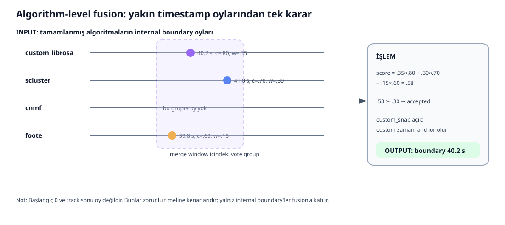

# Algorithm Fusion: fusion_service.py

Bu servis tamamlanmış custom_librosa, scluster, cnmf ve foote sonuçlarını birleştirir. Burada oy veren feature değil algoritmadır.

~~~mermaid
flowchart LR
    A[custom result] --> E[Internal boundary oyları]
    B[scluster result] --> E
    C[cnmf result] --> E
    D[foote result] --> E
    E --> F[merge_window ile grupla]
    F --> G[Algoritma başına en iyi oy]
    G --> H[Σ weight × confidence]
    H --> I{Kabul?}
    I -- Evet --> J[Fused time seç]
    I -- Hayır --> K[Rejected diagnostics]
    J --> L[Min duration + segments]
    L --> M[Labels + silence]
    M --> N[OUTPUT Fusion result]
~~~

## Default weights

| Algoritma | Weight |
|---|---:|
| custom_librosa | 0.35 |
| scluster | 0.30 |
| cnmf | 0.20 |
| foote | 0.15 |

Override sonrası servis weight'leri tekrar normalize etmez; threshold aynı score ölçeğiyle düşünülmelidir.

## Helper methodlar

### _collect_leading_silence_ends()

İlk 2 s içinde başlayan Silence segmentlerinin bitişini toplar. 0.5–30 s aralığını kabul eder; 2 s yakın değerleri cluster edip median alır. Median, uç tahminin ortak zamanı çekmesini azaltır.

### _reinsert_silence_segments()

Fused segment silence-end zamanını içeriyorsa böler. Ön parçaya Silence label, confidence ve reason yazar.

### _duration_from_results()

duration_seconds alanlarını ve segmentlerin maksimum end değerlerini toplar; maksimumu ortak süre seçer. Eksik alana fallback sağlar.

### _internal_boundaries_from_result()

Önce açık boundaries listesini kullanır. İlk 0.5 s ve track sonuna 0.5 s yakın edge'leri atar. Liste yoksa segmentlerden internal boundary türetir.

### _group_votes()

Oyları zamana sıralar. Yeni oy son grubun güncel ortalamasına merge window kadar yakınsa eklenir; değilse yeni grup açılır. Greedy/sıralı grouping'dir, global clustering değildir.

### _choose_fused_time()

custom_snap ve custom oyu varsa en güvenli custom zamanı seçilir. Aksi halde:

    fused_time = Σ(weightᵢ × confidenceᵢ × timeᵢ)
                 / Σ(weightᵢ × confidenceᵢ)

Payda 0 ise basit zaman ortalamasına dönülür.

## fuse_algorithm_results() adım adım

1. Params ve weight override'larını okur.
2. Algoritma adlarını canonical yapar.
3. Duration ve leading silence bulur.
4. Dört baseline'ın internal boundary'lerini oy yapar.
5. Eksikleri failed_or_missing listesine ekler.
6. Yakın oyları gruplar.
7. Algoritma başına en güvenli oyu tutar.
8. score = Σ weight × confidence hesaplar.
9. Fused time seçer.
10. Score threshold'u geçerse veya source sayısı yeterliyse kabul eder.
11. Minimum segment süresini uygular.
12. Boundary'lerden segment üretir.
13. Kısa segmentleri birleştirir.
14. İki katmanlı labeling uygular.
15. Leading silence'ı geri ekler.
16. Kabul/reddedilen grupları diagnostics'e koyar.
17. Normalized result döndürür.

## Servis default'ları

| Parametre | Default |
|---|---:|
| merge_window_seconds | 2.5 |
| threshold | 0.30 |
| min_segment_duration_seconds | 5.0 |
| anchor_strategy | custom_snap |
| required_vote_count | 1 |

API/request başka değer geçebilir; servis default'u ile runtime değerini karıştırma.

## Sayısal örnek

    custom:   time=40.2, confidence=0.80, weight=0.35
    scluster: time=41.0, confidence=0.70, weight=0.30
    foote:    time=39.8, confidence=0.60, weight=0.15

    score = 0.35×0.80 + 0.30×0.70 + 0.15×0.60
          = 0.28 + 0.21 + 0.09
          = 0.58

Threshold 0.30 ise kabul edilir. custom_snap zamanı 40.2 seçer. Weighted mean yaklaşık 40.40 s olurdu.

## _dedupe_and_enforce_boundaries()

- Başlangıca minimum süreden yakın boundary'yi atar.
- Sona minimum süreden yakın boundary'yi atar.
- Birbirine fazla yakın iki boundary'den confidence'ı yüksek olanı tutar.

Yalnız duplicate değil, final segment süre kısıtını da uygular.

## Diagnostics

Her boundary_group içinde raw_times, sources, score, fused_time ve accepted bulunur. Böylece yalnız final cevap değil, kararın hangi oylarla verildiği görülebilir.

## Kritik nüanslar

- Kabul koşulu score threshold VEYA vote count'tur.
- Default required count 1 olduğundan tek source kabul edilebilir; çağıran daha konservatif değer geçebilir.
- Confidence'lar tam calibrated probability değildir.
- Consensus doğruluk garantisi değildir; algoritmalar aynı sistematik hatayı paylaşabilir.
- Fusion başarısı dataset evaluation ile ölçülmelidir.
