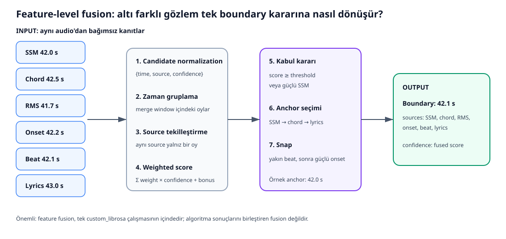

# Feature Fusion: multi_feature_fusion.py

Bu dosya feature kaynaklarından boundary candidate üretir ve bunları tek boundary setinde birleştirir.

~~~mermaid
flowchart LR
    A[RMS] --> G[Ortak candidate şeması]
    B[Onset] --> G
    C[Chord] --> G
    D[Beat] --> G
    E[Lyrics] --> G
    F[SSM] --> G
    G --> H[Zamana göre grupla]
    H --> I[Source başına en iyi oy]
    I --> J[Weighted score + bonus]
    J --> K{Kabul?}
    K -- Evet --> L[Anchor seç]
    L --> M[Beat/onset snap]
    M --> N[OUTPUT Fused boundary]
    K -- Hayır --> O[Rejected diagnostics]
~~~

Ortak candidate örneği:

    {"time": 42.3, "source": "rms", "confidence": 0.71}

## Genel yardımcılar

- normalise_curve(): NaN/sonsuzları temizler, minimumu çıkarır, maksimuma böler; eğriyi [0,1] yapar.
- curve_confidence(): Boundary'ye en yakın frame novelty değerini confidence yapar.
- candidates_from_boundaries(): Zaman listesini ortak candidate sözlüklerine çevirir.
- find_boundaries(): Novelty'yi yumuşatır; minimum uzaklık/prominence sağlayan peak'leri bulur; track kenarlarını atar; frame merkezini saniyeye çevirir.

distance = min_segment_s × fps, aynı bölgede fazla peak oluşmasını önler.

## Candidate kaynakları

### rms_boundary_candidates()

    RMS -> dB -> smoothing -> |ardışık fark|
        -> interpolation -> normalization -> peak

RMS yüksekliği değil değişimi aranır. Hata halinde boş candidate/sıfır eğri döner; diğer kaynaklar devam eder.

### onset_boundary_candidates()

Onset-strength eğrisini çıkarır, yumuşatır, ortak grid'e taşır ve peak'leri candidate yapar. Snapping için ham onset times/env de döndürür.

### tempo_and_beats()

BPM ve beat frame'lerini bulup saniyeye çevirir. Hata halinde 0 BPM ve boş dizi döner.

### beat_phrase_boundary_candidates()

16, 24, 32, 48 beat grid'lerini ve başlangıç offset'lerini dener. SSM support ve onset gücü yüksek fazı seçer:

    phase_score = 0.75 × support + 0.25 × onset
    confidence = 0.40 + 0.40 × local_support + 0.15 × local_onset

Her beat'i değil, bölüm ölçeğindeki phrase başlangıçlarını önerir.

### chord_proxy_boundary_candidates()

CENS çok yumuşak olduğundan bitişik frameler yerine yaklaşık yarım saniye öncesi/sonrası karşılaştırılır:

    chord_change = 1 - cosine_similarity

Proxy, chord adını gerçekten çıkarmadan armonik değişimi yaklaşık temsil eden ölçümdür.

### lyrics_boundary_candidates()

Zaman damgalı, boş olmayan lyric satırlarını aktif timeline'a taşır. Her satır boundary değildir; orta güvenli ek kanıttır.

_dedupe_candidates() aynı pencere içindeki adaylardan confidence'ı yüksek olanı tutar.

## Weight hazırlama

normalise_feature_weights() override uygular, negatifleri 0'a kırpar, toplamı 1 yapar. Eski spectral_flux_weight parametresini onset_flux'a map eder.

| Source | Default |
|---|---:|
| SSM | 0.42 |
| chord proxy | 0.18 |
| lyrics | 0.10 |
| onset flux | 0.06 |
| RMS | 0.06 |
| beat | 0.02 |

## fuse_feature_candidates()

1. Track kenarına yakın adayları atar.
2. Zamanca yakın adayları grup ortalamasına göre birleştirir.
3. Aynı source'un yalnız en güvenli oyunu tutar.
4. Σ weight × confidence hesaplar.
5. Kaynak çeşitliliği için en fazla 0.15 bonus ekler.
6. Threshold geçilirse veya güçlü SSM varsa kabul eder.
7. Anchor zamanı seçer.
8. Minimum segment süresi uygular.
9. Budget aşılırsa en güçlü boundary'leri tutar.

Aynı source'un on yakın adayı on bağımsız oy sayılmaz; gürültülü kaynak fusion'ı ele geçiremez.

## Anchor ve snapping

_choose_boundary_anchor() zaman için sırasıyla SSM, chord proxy, lyrics tercih eder. Yoksa weight × confidence en yüksek aday seçilir.

snap_fused_boundaries():

1. Beat sync açıksa 0.25 s içindeki beat'e gider.
2. Beat yoksa onset penceresindeki en güçlü onset'e bakar.
3. Onset ancak eğrinin 75. yüzdeliği kadar güçlüyse kullanılır.
4. Snap kaynağını sources listesine ekler.
5. Yakın duplicate'lerden güçlüyü tutar.

Fusion “geçiş 42 s çevresinde”, snapping “ritmik olay 42.13 s” kararını verir.

fuse_boundary_candidates(), geriye uyumluluk için fuse_feature_candidates() alias'ıdır.

## Parametre sezgisi

- Merge window büyürse daha uzak adaylar birleşir; ayrı boundary'ler yanlış birleşebilir.
- Threshold büyürse kabul zorlaşır; precision artabilir, recall düşebilir.
- SSM tek başına geçebilir, çünkü ana structural sinyal olarak tasarlanmıştır.
- Onset weight düşüktür, çünkü nota/vuruş başlangıçları section değişiminden çok sıktır.
