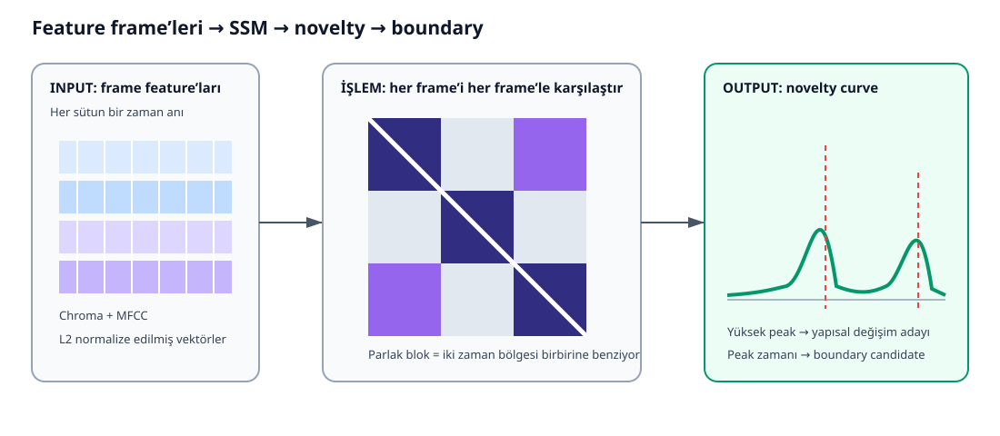

# Custom Pipeline: segmentation_service.py

Bu dosya custom_librosa algoritmasının uçtan uca DSP akışıdır.

## Pipeline diyagramı

~~~mermaid
flowchart TD
    A[INPUT MP3/WAV veya bytes] --> B[Stage 0 Decode, mono, 22.050 Hz]
    B --> C[Stage 0b RMS ile active region]
    C --> D[Stage 1 Chroma-CENS + MFCC + pooling]
    D --> E[Stage 2 Chroma/MFCC SSM]
    D --> F[RMS, onset, chord, beat, lyrics candidates]
    E --> G[Stage 3 Smoothing + threshold]
    G --> H[Stage 4/5 SSM novelty]
    H --> I[SSM candidates]
    F --> J[Stage 6 Dynamic weight + feature fusion]
    I --> J
    J --> K[Beat/onset snapping]
    K --> L[Stage 7 Clustering + labels]
    L --> M[Stage 8 Timeline offset correction]
    M --> N[OUTPUT segments, boundaries, BPM, diagnostics]
~~~

İki paralel kol vardır: SSM yapısal novelty üretirken diğer feature'lar kendi candidate'larını üretir; Stage 6'da birleşirler.

SSM görselinde input feature sütunlarıdır; işlem bütün zaman çiftlerini karşılaştırmaktır; output önce kare benzerlik matrisi, sonra tek boyutlu novelty eğrisidir.

## Stage 0 — yükleme ve aktif bölge

- _find_ffmpeg(): Hızlı decoder'ı bulur.
- _load_audio_ffmpeg(): Sesi mono, 22.050 Hz, float32 PCM'e çevirir.
- _load_audio_from_bytes(): Bellekteki sesi Librosa ile yükler.
- _detect_active_region(): RMS dB eğrisini yumuşatır; P75 - 20 dB üstündeki ilk/son frame'i aktif bölge sayar. Bulamazsa bütün track'e döner.

P75, değerlerin yüzde 75'inin altında veya eşit olduğu noktadır. Göreli eşik, farklı mastering seviyelerine tek sabit dB zorlamaz. Analiz aktif bölgede yapılır; final zamanlara act_start geri eklenir.

## Stage 1 — feature çıkarma

_extract_downsampled_features():

1. Chroma-CENS, hata halinde Chroma-CQT çıkarır.
2. MFCC çıkarır; enerji baskısını önlemek için MFCC0'ı atar.
3. _median_pool() ile frame sayısını azaltır.
4. MFCC boyutlarını z-score standardize eder.
5. Her frame sütununu L2-normalize eder.
6. Frame merkez zamanlarını üretir.

Çok uzun track'te ikinci pooling yapılır. SSM N×N olduğundan N iki katına çıkarsa hücre sayısı yaklaşık dört kat olur; _MAX_SSM_FRAMES=2000 sınırı bunu kontrol eder.

## Stage 2 — SSM

- _compute_raw_ssm(): Normalize feature matrisini transpozuyla çarpar; cosine benzerlik matrisi üretir.
- _compute_ti_chroma_ssm(): Chroma'yı 12 nota kaydırmasında karşılaştırıp maksimumu tutar. Başka tona taşınmış tekrarları yakalar.
- _build_combined_ssm(): Chroma armonisini ve MFCC tınısını yarı yarıya birleştirir. MFCC kapalıysa yalnız chroma kullanır.

## Stage 3 — SSM enhancement

Tekrarlar SSM'de diagonal yollar oluşturur. _diagonal_smooth_theta() bu yollar boyunca ortalama alır; theta farklı tempo oranlarını temsil eder. _smooth_ssm() ileri ve geri yönleri kullanarak tek yönün boundary'yi kaydırmasını azaltır.

_threshold_ssm() en güçlü üst yüzde 20 hücreyi tutar ve [0,1] yapar. Zayıf benzerliklerin structural grouping'i bulandırması azalır.

## Stage 4/5 — novelty

_compute_novelty_ssm() köşegen üzerinde checkerboard kernel kaydırır. Boundary öncesi kendi içinde, sonrası kendi içinde benzer; iki taraf birbirinden farklıysa dama deseni yüksek cevap verir.

_structure_feature_novelty() her anın bütün şarkıyla tekrar ilişkisini time-lag sütununa çevirir. Ardışık sütunların L2 farkı global tekrar bağlamı değişimini ölçer.

    SSM novelty = 0.60 × checkerboard + 0.40 × structure-feature

_analyze_content() tempo/beat, RMS, onset, chord, lyrics ve SSM işlerini aynı feature girdisinden paralel başlatır.

## Dynamic weights

_novelty_snr() düz eğriyi düşük, keskin tepeli eğriyi yüksek güvenli sayar:

    confidence = clip((P90 / mean - 1) / 2, 0, 1)

_beat_regularity() formülü 1 - std(IBI)/mean(IBI)'dir. _lyrics_confidence() süreye göre lyric yoğunluğunu kullanır. _compute_dynamic_weights(), static_weight × source_confidence hesaplayıp toplamı 1 yapar.

## Fusion, snapping, budget

    boundary_budget = max(1, int(core_duration / boundary_density_seconds) - 1)

Çalışan kod boundary_density_seconds için 22.0 kullanır; fonksiyon docstring'indeki 9.0 güncel kodla uyumsuzdur.

Fusion sonrası boundary yakındaki beat'e, yoksa güçlü onset'e hizalanabilir. Fusion boş ama SSM boundary varsa kontrollü fallback vardır.

## Segment ve label

_segment_feature_vector() segmentin mean, frame-delta mean ve standard deviation değerlerini birleştirir.

_ssm_segment_labels() segment çifti SSM alt bloğu ortalamasını tekrar benzerliği sayar ve average-linkage clustering uygular. _select_n_clusters() silhouette ile k seçer.

_cluster_and_label_segments() önce SSM clustering, olmazsa KMeans kullanır; kümeleri sıklığa göre A/B/C yapar; _enforce_min_segment_duration() kısa segmentleri komşuya birleştirir; semantic label'ı ayrı ekler.

process_file_path() public giriş, _analyze_content() gerçek Stage 0–8 pipeline'ı, _empty_result() aktif müzik yoksa boş fakat geçerli sonuç üreticisidir.

## Metot haritası

| Grup | Çözdüğü problem |
|---|---|
| Load | Sesi ortak forma getirme |
| Active region | Baştaki/sondaki sessizlik etkisini azaltma |
| Feature | Sample'ı müziksel özete çevirme |
| SSM | Zamanlar arası tekrar benzerliği |
| Novelty | Yapısal değişimi tek eğriye çevirme |
| Fusion | Kanıtları birleştirme |
| Clustering | Benzer segmentlere structural label verme |
