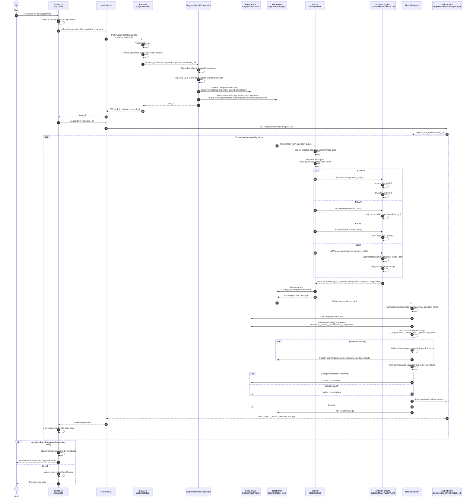

# Main Segmentation Flow

```mermaid
sequenceDiagram
    autonumber
    actor User
    participant UI as Svelte UI<br/>App.svelte
    participant Api as src/lib/api.js
    participant SegApi as FastAPI<br/>/segmentation
    participant Orch as SegmentationOrchestrator
    participant DB as PostgreSQL<br/>SegmentationTask
    participant MQ as RabbitMQ<br/>segmentation_topic
    participant W as Worker<br/>BaseWorker
    participant Analyzer as Analysis engine<br/>custom/MSAF/fusion/LLM
    participant Listener as ResultListener
    participant SSE as SSE stream<br/>/segmentation/stream/{task_id}

    User->>UI: Pick audio file and algorithms
    UI->>UI: Validate file and selected algorithms
    UI->>Api: uploadSegmentation(file, algorithms, params)
    Api->>SegApi: POST /segmentation/upload<br/>multipart FormData
    SegApi->>SegApi: Validate file type
    SegApi->>SegApi: Parse algorithms JSON and typed params
    SegApi->>Orch: process_upload(file, algorithms, params, webhook_url)
    Orch->>Orch: Normalize algorithms and trim params
    Orch->>Orch: Generate task_id and save upload to media/uploads
    Orch->>DB: INSERT SegmentationTask<br/>status=processing, expected_algorithms, results={}
    Orch->>MQ: Publish one message per dispatch algorithm<br/>routing_key=segmentation.custom/foote/cnmf/scluster/fusion/llm
    Orch-->>SegApi: task_id
    SegApi-->>Api: 200 {task_id, status: processing}
    Api-->>UI: task_id
    UI->>Api: subscribeToTask(task_id)
    Api->>SSE: GET /segmentation/stream/{task_id}
    SSE->>Listener: register_sse_callback(task_id)

    loop For each requested algorithm
        MQ-->>W: Deliver task from algorithm queue
        W->>W: Submit process_task() to worker thread pool
        W->>W: Resolve audio path<br/>upload path or storage blob cache
        alt custom
            W->>Analyzer: CustomWorker.process_task()
            Analyzer->>Analyzer: process_file_path()
            Analyzer->>Analyzer: _analyze_content()
        else MSAF
            W->>Analyzer: MSAFWorker.process_task()
            Analyzer->>Analyzer: msaf.process(file_path, boundaries_id)
        else fusion
            W->>Analyzer: FusionWorker.process_task()
            Analyzer->>Analyzer: fuse_algorithm_results()
        else LLM
            W->>Analyzer: LLMSegmentationWorker.process_task()
            Analyzer->>Analyzer: SegmentationService.segment_audio_dict()
            Analyzer->>Analyzer: SegmentationAgent.run()
        end
        Analyzer-->>W: {task_id, worker_type, algorithm, boundaries, segments, diagnostics}
        W->>MQ: Publish result<br/>routing_key=segmentation.result
        W->>MQ: Ack original task message
        MQ-->>Listener: Deliver segmentation.result
        Listener->>Listener: Normalize result payload and canonical algorithm name
        Listener->>DB: Load SegmentationTask
        Listener->>DB: Update results[key] = segments<br/>and store __result/__boundaries/__diagnostics
        Listener->>Listener: Add optional metadata keys<br/>__explanation, __evaluation, __processing_time
        opt fusion requested
            Listener->>Listener: Wait for base outputs or early-dispatch timeout
            Listener->>MQ: Publish segmentation.fusion with collected base results
        end
        Listener->>Listener: Compare received keys with expected_algorithms
        alt all expected results received
            Listener->>DB: status = completed
        else partial result
            Listener->>DB: status = processing
        end
        Listener->>SSE: Push payload if callback exists
        Listener->>DB: Commit
        Listener->>MQ: Ack result message
        SSE-->>Api: data: {task_id, status, filename, results}
        Api-->>UI: onMessage(data)
        UI->>UI: Merge data.results into page state
    end

    alt completed or all requested result keys exist
        UI->>UI: status=completed, close EventSource
        UI-->>User: Render result cards and segment JSON
    else failed
        UI->>UI: status=error, close EventSource
        UI-->>User: Render error state
    end
```
