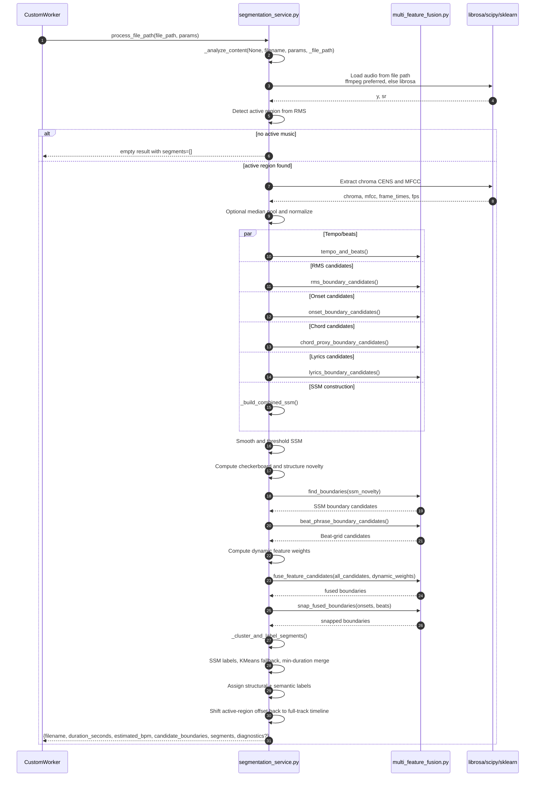

# Custom Analysis Pipeline

```mermaid
sequenceDiagram
    autonumber
    participant CustomW as CustomWorker
    participant Service as segmentation_service.py
    participant Fusion as multi_feature_fusion.py
    participant Librosa as librosa/scipy/sklearn

    CustomW->>Service: process_file_path(file_path, params)
    Service->>Service: _analyze_content(None, filename, params, _file_path)
    Service->>Librosa: Load audio from file path<br/>ffmpeg preferred, else librosa
    Librosa-->>Service: y, sr
    Service->>Service: Detect active region from RMS
    alt no active music
        Service-->>CustomW: empty result with segments=[]
    else active region found
        Service->>Librosa: Extract chroma CENS and MFCC
        Librosa-->>Service: chroma, mfcc, frame_times, fps
        Service->>Service: Optional median pool and normalize
        par Tempo/beats
            Service->>Fusion: tempo_and_beats()
        and RMS candidates
            Service->>Fusion: rms_boundary_candidates()
        and Onset candidates
            Service->>Fusion: onset_boundary_candidates()
        and Chord candidates
            Service->>Fusion: chord_proxy_boundary_candidates()
        and Lyrics candidates
            Service->>Fusion: lyrics_boundary_candidates()
        and SSM construction
            Service->>Service: _build_combined_ssm()
        end
        Service->>Service: Smooth and threshold SSM
        Service->>Service: Compute checkerboard and structure novelty
        Service->>Fusion: find_boundaries(ssm_novelty)
        Fusion-->>Service: SSM boundary candidates
        Service->>Fusion: beat_phrase_boundary_candidates()
        Fusion-->>Service: Beat-grid candidates
        Service->>Service: Compute dynamic feature weights
        Service->>Fusion: fuse_feature_candidates(all_candidates, dynamic_weights)
        Fusion-->>Service: fused boundaries
        Service->>Fusion: snap_fused_boundaries(onsets, beats)
        Fusion-->>Service: snapped boundaries
        Service->>Service: _cluster_and_label_segments()
        Service->>Service: SSM labels, KMeans fallback, min-duration merge
        Service->>Service: Assign structural + semantic labels
        Service->>Service: Shift active-region offset back to full-track timeline
        Service-->>CustomW: {filename, duration_seconds, estimated_bpm, candidate_boundaries, segments, diagnostics?}
    end
```
