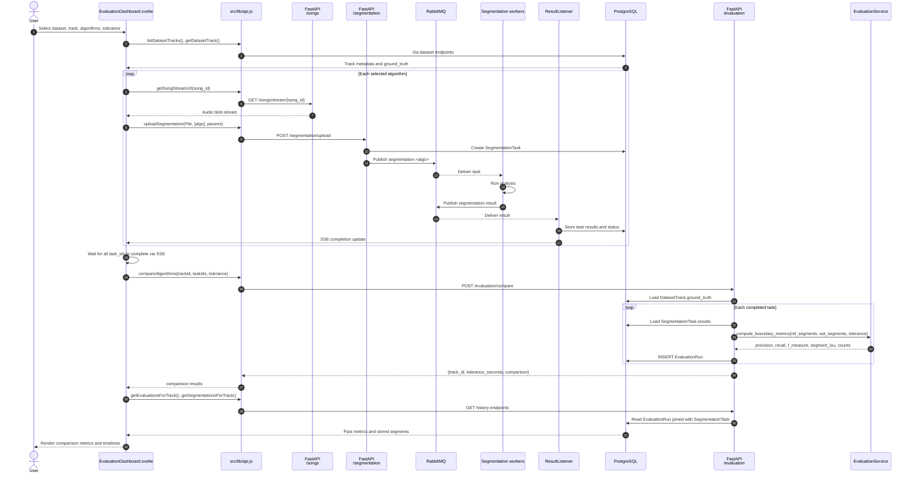

# Evaluation Compare Flow

```mermaid
sequenceDiagram
    autonumber
    actor User
    participant EvalUI as EvaluationDashboard.svelte
    participant Api as src/lib/api.js
    participant Songs as FastAPI<br/>/songs
    participant SegApi as FastAPI<br/>/segmentation
    participant MQ as RabbitMQ
    participant Workers as Segmentation workers
    participant Listener as ResultListener
    participant DB as PostgreSQL
    participant EvalApi as FastAPI<br/>/evaluation
    participant EvalSvc as EvaluationService

    User->>EvalUI: Select dataset, track, algorithms, tolerance
    EvalUI->>Api: listDatasetTracks(), getDatasetTrack()
    Api->>DB: Via dataset endpoints
    DB-->>EvalUI: Track metadata and ground_truth

    loop Each selected algorithm
        EvalUI->>Api: getSongStreamUrl(song_id)
        Api->>Songs: GET /songs/stream/{song_id}
        Songs-->>EvalUI: Audio blob stream
        EvalUI->>Api: uploadSegmentation(File, [algo], params)
        Api->>SegApi: POST /segmentation/upload
        SegApi->>DB: Create SegmentationTask
        SegApi->>MQ: Publish segmentation.<algo>
        MQ-->>Workers: Deliver task
        Workers->>Workers: Run analysis
        Workers->>MQ: Publish segmentation.result
        MQ-->>Listener: Deliver result
        Listener->>DB: Store task results and status
        Listener-->>EvalUI: SSE completion update
    end

    EvalUI->>EvalUI: Wait for all task_ids to complete via SSE
    EvalUI->>Api: compareAlgorithms(trackId, taskIds, tolerance)
    Api->>EvalApi: POST /evaluation/compare
    EvalApi->>DB: Load DatasetTrack.ground_truth
    loop Each completed task
        EvalApi->>DB: Load SegmentationTask.results
        EvalApi->>EvalSvc: compute_boundary_metrics(ref_segments, est_segments, tolerance)
        EvalSvc-->>EvalApi: precision, recall, f_measure, segment_iou, counts
        EvalApi->>DB: INSERT EvaluationRun
    end
    EvalApi-->>Api: {track_id, tolerance_seconds, comparison}
    Api-->>EvalUI: comparison results
    EvalUI->>Api: getEvaluationsForTrack(), getSegmentationsForTrack()
    Api->>EvalApi: GET history endpoints
    EvalApi->>DB: Read EvaluationRun joined with SegmentationTask
    DB-->>EvalUI: Past metrics and stored segments
    EvalUI-->>User: Render comparison metrics and timelines
```
