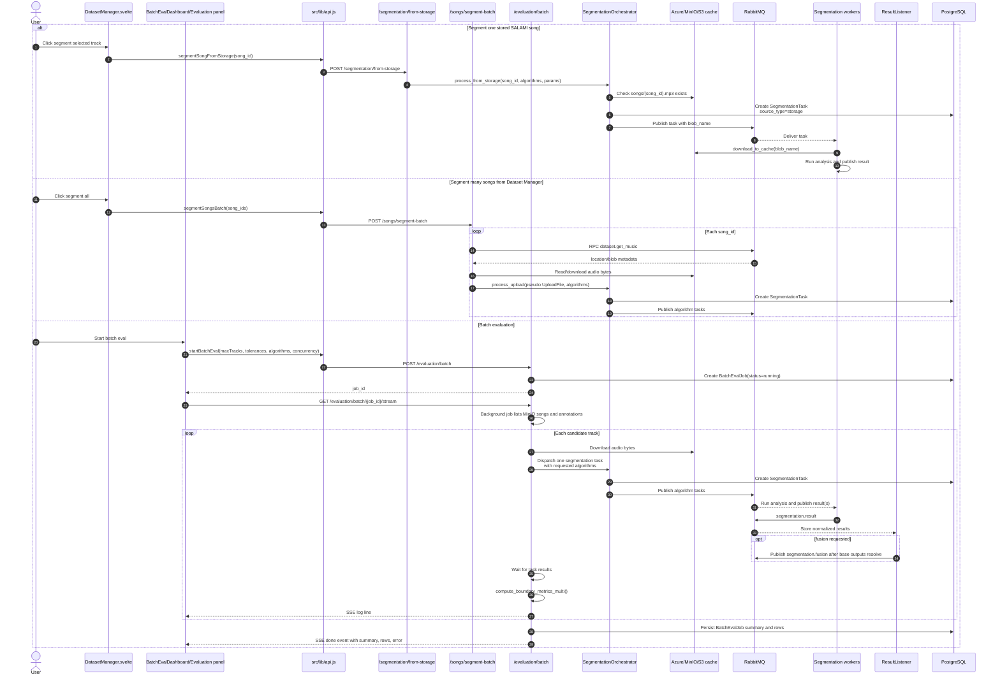

# Storage and Batch Variants

```mermaid
sequenceDiagram
    autonumber
    actor User
    participant DatasetUI as DatasetManager.svelte
    participant BatchUI as BatchEvalDashboard/Evaluation panel
    participant Api as src/lib/api.js
    participant SegApi as /segmentation/from-storage
    participant SongsApi as /songs/segment-batch
    participant EvalApi as /evaluation/batch
    participant Orch as SegmentationOrchestrator
    participant Blob as Azure/MinIO/S3 cache
    participant MQ as RabbitMQ
    participant Workers as Segmentation workers
    participant Listener as ResultListener
    participant DB as PostgreSQL

    alt Segment one stored SALAMI song
        User->>DatasetUI: Click segment selected track
        DatasetUI->>Api: segmentSongFromStorage(song_id)
        Api->>SegApi: POST /segmentation/from-storage
        SegApi->>Orch: process_from_storage(song_id, algorithms, params)
        Orch->>Blob: Check songs/{song_id}.mp3 exists
        Orch->>DB: Create SegmentationTask<br/>source_type=storage
        Orch->>MQ: Publish task with blob_name
        MQ-->>Workers: Deliver task
        Workers->>Blob: download_to_cache(blob_name)
        Workers->>Workers: Run analysis and publish result
    else Segment many songs from Dataset Manager
        User->>DatasetUI: Click segment all
        DatasetUI->>Api: segmentSongsBatch(song_ids)
        Api->>SongsApi: POST /songs/segment-batch
        loop Each song_id
            SongsApi->>MQ: RPC dataset.get_music
            MQ-->>SongsApi: location/blob metadata
            SongsApi->>Blob: Read/download audio bytes
            SongsApi->>Orch: process_upload(pseudo UploadFile, algorithms)
            Orch->>DB: Create SegmentationTask
            Orch->>MQ: Publish algorithm tasks
        end
    else Batch evaluation
        User->>BatchUI: Start batch eval
        BatchUI->>Api: startBatchEval(maxTracks, tolerances, algorithms, concurrency)
        Api->>EvalApi: POST /evaluation/batch
        EvalApi->>DB: Create BatchEvalJob(status=running)
        EvalApi-->>BatchUI: job_id
        BatchUI->>EvalApi: GET /evaluation/batch/{job_id}/stream
        EvalApi->>EvalApi: Background job lists MinIO songs and annotations
        loop Each candidate track
            EvalApi->>Blob: Download audio bytes
            EvalApi->>Orch: Dispatch one segmentation task<br/>with requested algorithms
            Orch->>DB: Create SegmentationTask
            Orch->>MQ: Publish algorithm tasks
            MQ-->>Workers: Run analysis and publish result(s)
            Workers->>MQ: segmentation.result
            MQ-->>Listener: Store normalized results
            opt fusion requested
                Listener->>MQ: Publish segmentation.fusion after base outputs resolve
            end
            EvalApi->>EvalApi: Wait for task results
            EvalApi->>EvalApi: compute_boundary_metrics_multi()
            EvalApi-->>BatchUI: SSE log line
        end
        EvalApi->>DB: Persist BatchEvalJob summary and rows
        EvalApi-->>BatchUI: SSE done event with summary, rows, error
    end
```
